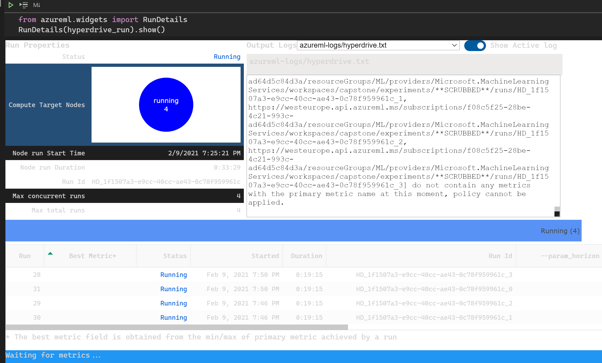
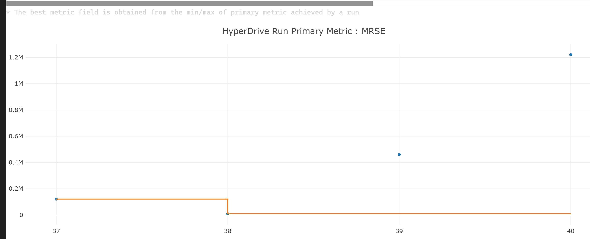
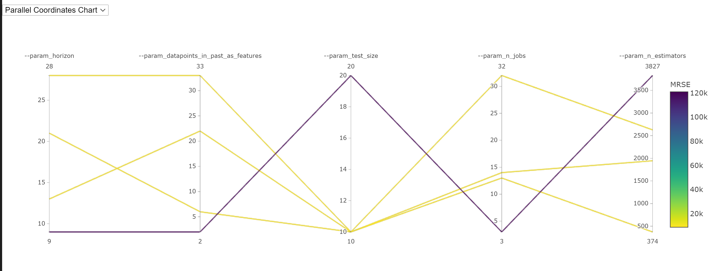

# Covid-19 cases forecasting

The project intends to build a model that can predict the number of infection cases of Covid-19 based on the selection of measures that are applied in that country. It uses data from the european disease center so the model is applicable for countries in Europe.

## Dataset

### Overview
The datasets used are from European Centre for Disease Prevention and Control. I used 2 datasets:

1 - [14-day notification rate of newly reported COVID-19 cases](https://opendata.ecdc.europa.eu/covid19/nationalcasedeath/csv) - Information on the 14-day notification rate of newly reported COVID-19 cases per 100 000 population and the 14-day notification rate of reported deaths per million population by week and country. Each row contains the corresponding data for a certain day and per country.  
2 - [COVID-19 national public response measures.](https://www.ecdc.europa.eu/sites/default/files/documents/response_graphs_data_2021-01-14.csv) - The response measures displayed are national measures, reported on official public websites. Response measures collected include mass gathering cancellations (for specific events or a ban on gatherings of a particular size); closure of public spaces (including restaurants, entertainment venues, non-essential shops, partial or full closure of public transport etc.); closure of educational institutions (including daycare or nursery, primary schools, and secondary schools and higher education); ‘stay-at-home’ recommendations for risk groups or vulnerable populations (such as the elderly, people with underlying health conditions, physically disabled people etc.); ‘stay-at-home’ recommendations for the general population (which are voluntary or not enforced); and ‘stay-at-home’ orders for the general population (these are enforced and also referred to as ‘lockdown’), use of protective masks in public spaces/on public transport (mutually exclusive voluntary recommendations and mandatory obligations shown separately) and also teleworking recommendations/closure of workplaces.

### Task
Forecast the number of cases per week per country. The data needed for that is in 2 datasets. One contains the measure taken and the corresponding start and end date. The second contains the number of cases per country per week. I will combine the 2 datasets and create the 3rd composite dataset. The measures will end up being one hot encoded per week.

### Access
To access the data I registered the 2 initial datasets and made a training pipeline that would join the 2 into the 3rd dataset. The 3rd dataset is saved in the default datastore of the workspace. The 3rd dataset then is manually registered in the machine learning studio. From here i use the standard way to access de registered dataset:
```Python
dataset = Dataset.get_by_name(ws, name='covid-19-measures-cases-weekly')
df = dataset.to_pandas_dataframe()
```

## Automated ML
To setup the automated ml run i used the forecasting task with the corresponding configuration.
The pipeline gave out the best model. One of the difficulties is the fact that in jupyter notebooks in vs code the intellisense is flaky - it works well for python files but not so for notebooks. Documentation is also not the best possible - for instance the forecasting_parameters parameter for the AutoMlConfig is not documented. 

# ForecastingParameters Configuration

We are going to create a forecasting model.  
Azure ml sdk has already a class that groups all the parameters needed for a forecasting task: `ForecastingParameters`.  

In our case the dataset timestamp column is called `week` so we set `time_column_name='week'`.  
We would like to have an accurate forecast for at least 10 weeks so we set the `forecast_horizon` to 10.   
We have the same time series repeated per country - to capture that we set the `time_series_id_column_names` to `['country']`.   
The time series frequency is per week and we can express that with the parameter `freq='W'`.  
Target_lags is set to auto because we don't know which features are dependent and which not.  
`target_rolling_window_size=10` means that we take into account 10 past records in order to perform the forecasting.  

## AutoML Configuration
We are going to create a forecasting model so we set `task='forecasting'`   
In order to get the model cross validated better we set the `n_cross_validations=30`  
We need to specify the column that we want to forecast so we set `label_column_name='rate_14_day'`  
The forecast task need to optimize for normalized_root_mean_squared_error because it is a better metric for values that do not differ in order of magnitudes from each other thus we set `primary_metric` to 'normalized_root_mean_squared_error'.  
Running the experiment for too long is not our goal so we set a timeout to 20 minutes: `experiment_timeout_hours=0.3`  
We will block the following models:
 - 'ExtremeRandomTrees' because it performs poor when there is a high number of noisy features (in high dimensional data-sets).
 - 'AutoArima' - because our dataset is a multivariate time series - it depends not only on one variable but on 64.
 - 'Prophet' because it works best with time series that have strong seasonal effects but in our case we don't know that and don't want to assume that either.  
 
To do that we set `blocked_models` to `['ExtremeRandomTrees', 'AutoArima', 'Prophet']`.   
We have already limited the run duration of our experiment to 20 minute so we will disable early stopping like this: `enable_early_stopping=False`

### Results

*TODO*: What are the results you got with your automated ML model? What were the parameters of the model? How could you have improved it?

*TODO* Remember to provide screenshots of the `RunDetails` widget as well as a screenshot of the best model trained with it's parameters.

## Hyperparameter Tuning

In hyperdrive tuning I needed to develop the training script for it to be fed with different parameters. I followed the series of Ethan Rosenthal [Time Series for scikit-learn People](https://www.ethanrosenthal.com/2019/02/18/time-series-for-scikit-learn-people-part3/) to develop a forecasting pipeline.

The bulk of work is in preparing the data and adjusting the parameters inherent to the forecasting task like the forecasting horizon, number of datapoints in the past to take into account, the number of tests samples. The pipeline consists of a horizon transformer a ReversibleImputer an AutoregressiveTransformer a ReversibleImputer and a MultiOutputRegressor with a LinearRegression as the regressor.

The parameters used in this pipeline are:
'--param_horizon' - the forecasting horizon and is an integer - in the hyperparameter run it has a range from 1 to 36 as the dataset slice has 57 data points and the test_size can be from 10 to 20 thus - 57 - 20 = 36. 
'--param_datapoints_in_past_as_features' - the number of past y data points to transform in features for the linear regression. It also depends on the size of the data slice and has a range of 1 to 36.
'--param_test_size' - the absolute size of the test set. It is a choice from 10 and 20.
'--param_n_jobs' - the number of jobs to use to parallelize the evaluation.
'--param_n_estimators' - in case of XGBoost regressor - use this value for the number of estimators to use.
'--save' - is a flag to let the script save the model.

I used the RandomSampler and quniform expression to have a linear search space for the most of the parameters.

I chose the Bandit stopping policy because it offers a way to account for local minima `slack_factor` and a way to apply it after a specific number of runs `evaluation_interval` which makes this policy well ballanced in terms of flexibility.

### Results
*Speaking of the results: not so good - the metric used for evaluation was the mean square root error which got to astronomical values for some runs:

### The run


### Metrics


### Search Space

 
## Model Deployment
I chose to deploy the automl trained model because the accuracy is way better.

## Screen Recording
The screencast of using the model can be found here: [Consuming a Trained Azure Auto ML Model](https://www.youtube.com/watch?v=jHTRUcPORj4)
